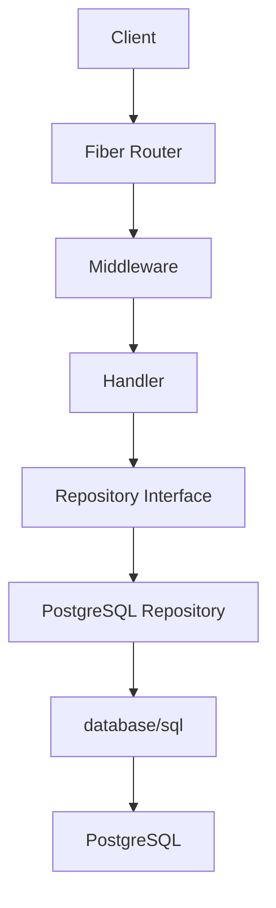

# Daya Listrik API

## Overview

Daya Listrik API is a RESTful backend service built with Go and Fiber for managing household electricity usage records, using PostgreSQL and raw SQL persistence. It stores a device name, a positive usage value, a positive duration value, and a server generated creation date. The original contract does not define units for `usage` or `duration`, so this API preserves those field names without guessing units.

## Features

Energy record CRUD, PostgreSQL persistence, parameterized raw SQL, request validation, structured errors, versioned migrations, OpenAPI documentation, automated tests, Docker support, and graceful shutdown.

## Architecture



Handlers own HTTP validation and status mapping. The repository owns SQL and persistence errors. A service layer is intentionally absent because the current domain is straightforward CRUD.

## Tech Stack

Go 1.24, Fiber v2, PostgreSQL, `database/sql`, `lib/pq`, raw SQL, `golang-migrate`, Fiber Swagger middleware, `testify`, `go-sqlmock`, and Docker.

## API Endpoints

| Method | Route | Success |
| --- | --- | --- |
| GET | `/api/records` | 200, JSON array |
| GET | `/api/records/{id}` | 200, record |
| POST | `/api/records` | 201, created record |
| PUT | `/api/records/{id}` | 200, updated record |
| DELETE | `/api/records/{id}` | 204, empty body |

Example create request:

```bash
curl -X POST http://localhost:8080/api/records -H "Content-Type: application/json" -d '{"device":"Air Conditioner","usage":100,"duration":2}'
```

`device` is trimmed and limited to 100 characters; `usage` and `duration` must be greater than zero. PUT replaces all three editable fields. `id` and `date` are managed by the server.

## Error Handling

Invalid input returns 400, missing records return 404, and unexpected failures return 500 without database details. For example:

```json
{"error":{"code":"RECORD_NOT_FOUND","message":"Energy record not found"}}
```

## Getting Started

Prerequisites: Go 1.24 and PostgreSQL, or Docker with Compose.

```bash
git clone https://github.com/kalislami/daya-listrik-api.git
cd daya-listrik-api
cp .env.example .env
```

Set `DB_PASSWORD` and other values for your local database in `.env`, then run `go run ./cmd/server`. The app also works with environment variables alone; `.env` is optional. `PORT` defaults to 8080, `DB_PORT` to 5432, `DB_SSLMODE` to `disable`, and `CORS_ALLOWED_ORIGINS` to `http://localhost:5173`. Set `DB_SSLMODE` appropriately in deployed environments.

For Docker, set `DB_PASSWORD` in your environment or `.env`, then run `docker compose up --build`. Compose waits for PostgreSQL readiness. The app verifies the connection before starting HTTP and fails startup when connection or migration fails.

## Database Migration

On startup, `golang-migrate` applies numbered SQL migrations embedded in the binary and tracks the applied version in PostgreSQL. Already applied migrations do not run again. Migration failure stops startup. The first migration also backfills nullable `duration` values from older installations to `1` before enforcing `NOT NULL`. Add new changes as paired `migrations/00000N_name.up.sql` and `.down.sql` files; do not edit an applied migration. The down migration for the initial table drops its data, so review before using it manually.

## API Documentation

Open the Swagger UI at `http://localhost:8080/swagger` or read [the OpenAPI source](docs/openapi.yaml). Edit that YAML directly when the API contract changes; there is no generated file or generation command. The [Postman collection](daya-listrik.postman_collection.json) is an optional client example.

## Testing

```bash
go fmt ./...
go vet ./...
go test ./...
go test -bench . ./tests -run=^$
```

Handler tests cover valid and invalid requests. Repository tests use SQLMock to verify raw SQL, parameters, scan results, missing rows, and database failures.

## Design Decisions

Fiber handles HTTP and middleware. `database/sql` and raw SQL make database interactions explicit. The repository interface allows handler tests without PostgreSQL. The project uses no service layer because it currently has no complex business workflow.

Licensed under [MIT](LICENSE).
